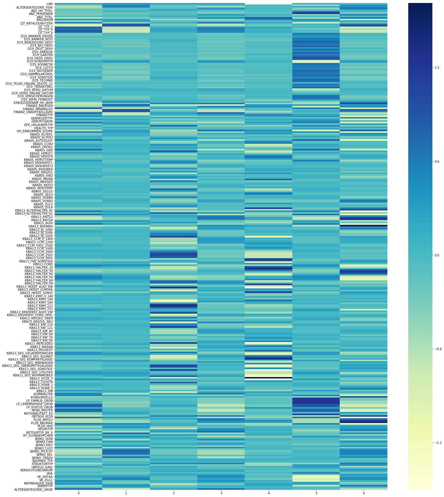

# Arvato-Analyses
<b>Table of Contents:</b>
<b>Libraries Used:</b>
<b>Files Description</b>
<b> Datasets and Inputs</b>
<b> My Questions </b>
<b> Data Science Approuch</b>
<b>Algo used:</b>
<b>My findings</b>
<b>Acknowledgments and thanks</b>

<b>Libraries Used:</b>
The project was done on Jupyter Notebook and Python 3.0, below are the libraries used:
1. Matplotlib
2. Seaborn
3. Pandas
4. Numpy
5. Sklearn

<b>Domain Background:</b>
The Arvato company has its own customer data from its customers when interacting and purchasing products and also has data of the German population at large. Such data can be used to identify what are the main characteristics of its customer and then use these to better target the population at large that are similar to their customer base. Such an analyses provides a strong advantage for Arvato to be efficient in selling their products to the right customer. Also targeting the customers that will purchase their products.  This will also reflect on the cost of Arvato. They can better cross sell products at a less expensive manner using the channels that will maximize them reaching their correct target audience.
If we can succeed in identifying who are the customers of Arvato in the population then this provides a huge advantage to them. From a cost perspective, the mailing costs can be reduced when sending the mail to the correctly identified customers. Also sending less mail to the wrong customer base.  This analyze if successful can even provide insights on who are the future customers of Arvato, what is their age groups, and will they be still using such a service within a few years. Change is moving fast in today’s economy and such analyses will provide insights for the future of Arvato customers demographics. 

<b>Files Description</b>
1. customer demographic, the file that has the customer of Arvato
2. a population demographic file for the unsupervised part that has the German population data 
3. attributes (excel file) the file that has the labels of each element. 
4. explanation of these attributes. A file explaining what are these attributes. 

<b> Datasets and Inputs</b>
There are four data files associated with this project:
The below two file will be used for the first problem of unsupervised learning.
Udacity_AZDIAS_052018.csv: Demographics data for the general population of Germany; 891 211 persons (rows) x 366 features (columns). This file has all the population of Germany data, and this file will be used later for comparison and data cleaning. 
Udacity_CUSTOMERS_052018.csv: Demographics data for customers of a mail-order company; 191 652 persons (rows) x 369 features (columns). This file will be used to compare later who from the population fits and is similar to the customer. This will help in further analyses later.

The below two file will be used for the supervised learning problem.
Udacity_MAILOUT_052018_TRAIN.csv: Demographics data for individuals who were targets of a marketing campaign; 42 982 persons (rows) x 367 (columns). The train file will help in fitting a model, and testing different models to see which one fits the data better. Based on this file we can know if our model generalize well or not.
Udacity_MAILOUT_052018_TEST.csv: Demographics data for individuals who were targets of a marketing campaign; 42 833 persons (rows) x 366 (columns). This file will be the final file to test the model with.

<b> My Questions </b>
After looking into the data, and trying to understand what is collected and how it can be used to better visual the data,
below are a few question i came up with. The answers should provide some insight.

1. What are the parameters of the customers and non-customers, and see how different they are.
2. Can we cluster the general population and the Arvato customers.
3. What characterizes each cluster from the other, the main features.
4. Who is more likely to want to receive a mail order between the general population.

<b> Data Science Approuch</b>
To address the first problem of clustering both the customers and the population we will need to perform certain tasks to achieve the results intended:
The files need to be processed and cleaned, and ensure that both files have similar cleaned features to be processed in machine learning. This step can be useful for both problems being addressed.
To separate customer, we will be using Kmeans and PCA. PCA will be used to reduce the dimensionality of the features. The large number of features will slow down any algorithm hence the reduction. We also need to find which features effect the model and which are redundant. PCA will provide part of the solution to be then used in Kmeans. 
Kmeans here will cluster the population based on similar attributes. This model will then be fitted to both files and see what are the similarities between them, and what feature affect the most. These feature will also provide insight into what is a Arvato customer profile and what is the population profile is. This should also help in advertising for the right customer and reduce mail costs when implemented later. 
The second part of the problem being addressed is the predicting of who will likely be more interested in receiving a mail campaign of the population:
This part will require a file that already has customers who got mailed and who responded or not responded to the campaign. Using such a file will require the use of machine learning to fit a model on customers who responded. Then by using unseen data, we can predict the probability of a customer responding to the mail campaign. This problem is different from the first, this is a supervised problem and the first is unsupervised. 

<b>Algo used:</b>
Algorithms and Techniques
For the Unsupervised part of the problem, PCA was chosen due to the large size of the features, and Kmeans is required to cluster the customers and the population. Both PCA and Kmeans default parameters where kept just to explore the data. But after some exploring, the PCA component where chosen and Kmeans K too.
As for the Supervised part, all the model used are:
AdaBoostClassifier
GradientBoostingClassifier
LogisticRegression

<b>My findings</b>
The Unsupervised requires its own metrics, for identifying the K in Kmeans and the correlation in the features related to each cluster. 
The elbow method and the sum of squares errors was used to choose the K. The best cluster was 7.
The heat map was used to see the negative and positive correlations between the features and the clusters. 
The components with the highest and lowest weights explain the similar and dissimilar cluster do make sense.

